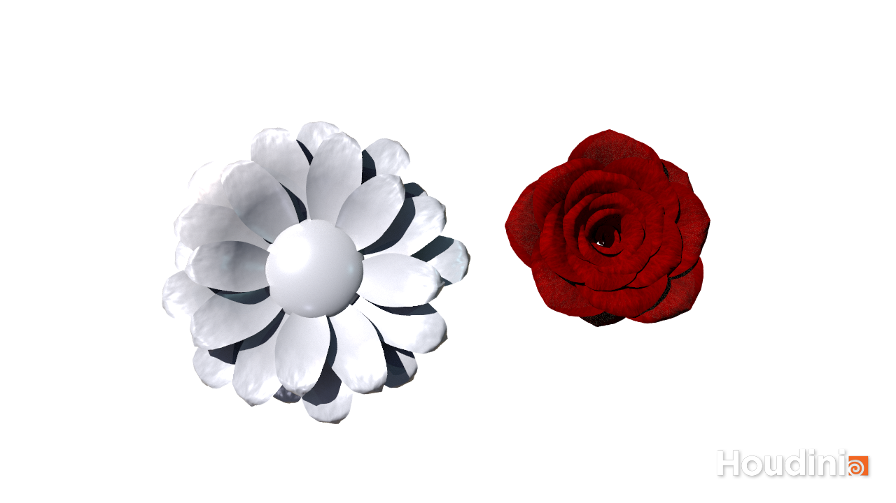
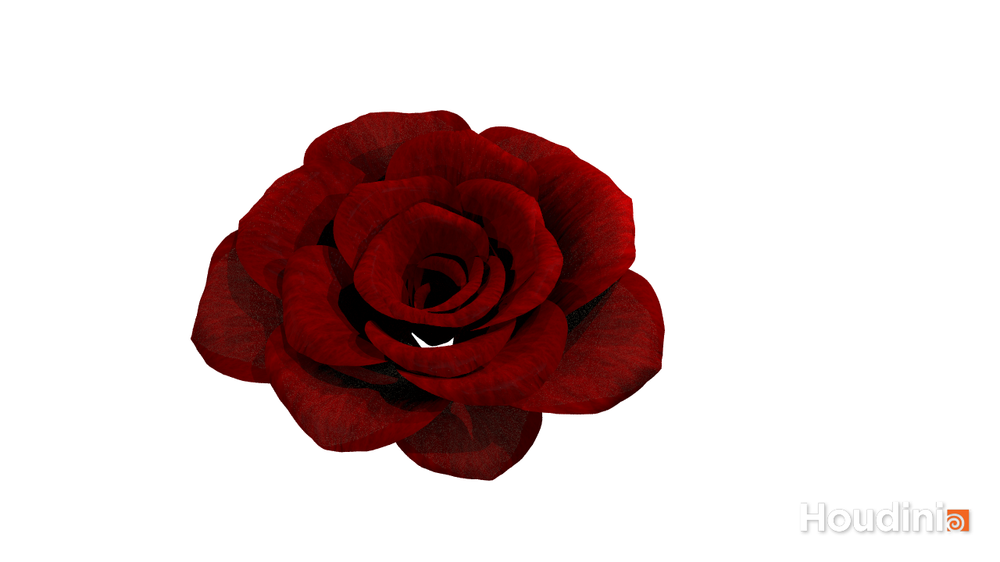
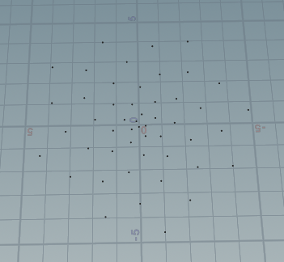

# Procedural Flower Tool

#### Introduction
When I first started learning about proceduralism, I was always fascinated by the occurrences of proceduralism in nature such as fractal plants and flowers. Here’s a link to some cool instances of fractals in nature http://eeobcourseblogwolfestudents.blogspot.com/2014/12/qu.html 
In this project, I will explore how to create a tool that makes various blooming flowers in Houdini. 

#### Goal
I envision the final output of this project being an art directable flower tool, that allows the user to easily and quickly create beautiful flowers with high variance. I am also interested in learning more about Houdini’s features, specifically in animation and simulation. I hope to add in features such as customizable animations depending on the flower bloom and wind simulation. 

#### Inspiration/reference:
Here is a link to some visual inspiration of different types of flowers blooming in slow motion: https://youtu.be/CV2P-xsEiYE?t=1398
Procedural baobab flower breakdown: https://vimeo.com/321053835
Never ending flower bloom: https://www.youtube.com/watch?v=J2rDQtsTwzo&ab_channel=Entagma

This may not be extremely relevant to the scope of this project, but I found a design simulation talk that looked really interesting. It may be something I can incorporate into the tool to make it more abstract and fantasy like in the future: https://www.youtube.com/watch?v=jeuo5DjRsq0&ab_channel=Houdini

#### Specification:
1. Create a basic tool that generates a single flower procedurally
- Import a petal with a texture and rotate around center n number of times
- Add blooming animation that follows pattern from visual reference
2. Fine tune tool to add more variance and input controls
- Focus on getting a really nice render of one flower - will have to learn how to light a scene
3. Use flower tool to fill a bouquet of flowers or populate some organic scene

#### Techniques:
The technical aspect of this project will involve problem solving in how to recreate certain patterns and features of the flowers procedurally in Houdini. While some of the flowers have a relatively consistent shape radially, other flowers like orchids do not bloom directly from the center, and their petal shapes are a bit more irregular.

Creating a tool that gives the user flexibility to create flowers of all different petal shapes and blooming patterns will definitely be an interesting technical challenge!

Here is a great example of a similar tool made using Houdini: https://80.lv/articles/procedural-flower-tool-in-houdini/ 

#### Timeline:
Week 1: 
Create basic tool that generates a simple flower with basic animation
Week 2:
Fine tune tool to add more variance and increase complexity
Learn how to create a high quality render
Week 3:
Create final scene using tool with at least 5-6 different types of flowers and plants
Add finishing touches like wind simulation and dust particles 

# Milestone 2
For this milestone, I followed a tutorial to make a simple flower bloom with textures. It was great to learn about animation and I have started thinking about how to edit the parameters to make the tool customizable for many different types of flowers. 

# Milestone 3
 

### Golden Ratio Petal Structure
Originally, the way I was creating the petal pattern for the flower was a simple loop around a circle. However I wanted to create a tool with more complex features that outputed an organic looking flower. I found this interesting rose render: https://www.youtube.com/watch?v=SN6por9uaCI&ab_channel=MotionDesignersCommunity and followed Vladyslav Lavrenov's scene files to produce a set of points that spiral based on the golden ratio.

Here is a quick summary of the algorithm used:
For every petal in the flower, I want to calculate the petal's position by finding its polar coordinates (radius and angle). The radius is proportional to the number of petals, so that the spiral continues to grow as we increase the petals. The golden angle is added to the angle for every petal, driving the spiral's curve.

### Flower and Petal Parameters
Parameters are categorized into flower paraemeters, for changes to the overall shape of the flower, and petal parameters, for changes to individual petals. I wanted to focus on improving the usability of the tool and fine tuning the parameters of the petal subnetwork to maximize flower variance and allow artistic specificity. 

After studying many different types of flowers, it became apparent that there is a relationship between the petal's distance from the center and the petal's size and bend amount. For this reason, I thought it would be best to have the petal size and bend amount be ramp parameters based on the petal's distance from the center. "Petal Bend" controls the overall concavity of the petal, while "Petal Top Bend" controls how much the petal flares out from the top, and the "Petal Side Bend" controls how much the petal folds in on itself. Based on the values and positions of these parameters, a user can create a rose or a tulip!

Link to demo of parameters: https://vimeo.com/650966824

### Goals
Now that I have successfully created a tool that procedurally models various types of flowers, I would like to acheive the following for the final submission: 
1. Create at least 3 different types of flowers using the tool and output high quality renders.
2. Add a stem feature (potentially having the user draw a curve for the stem to follow and have the flower blossom on the end of it)
3. Add more procedural details to model the center of the flower: filaments, anthers, stigma, etc. 
